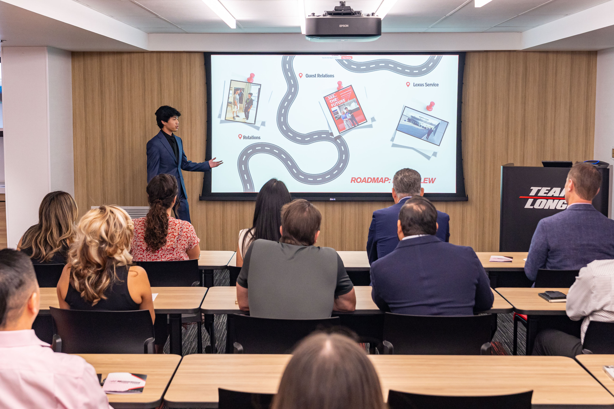

---
title: "Home"
---

# Ethan Lew

## Marketing Student

## Sports Marketing \| Data Analytics \| Brand Strategy

------------------------------------------------------------------------

## About Me

I am a marketing student at Cal Poly Pomona with a strong interest in sports marketing, brand strategy, and data analytics. I enjoy analyzing consumer behavior, sports trends, and marketing performance to better understand how brands engage with audiences.

My experience includes data visualization, research analysis, dashboard creation, and presentation development using tools such as Tableau, Excel, R, Quarto, and GitHub.

I am passionate about combining creativity and analytics to support strategic marketing decisions in the sports industry.

------------------------------------------------------------------------

## Education

### California State Polytechnic University, Pomona

-   Major: Marketing
-   Relevant Coursework:
-   Marketing Analytics
-   Consumer Behavior
-   Information Systems
-   Data Visualization
-   Research Methods
-   Digital Marketing

------------------------------------------------------------------------

## Technical Skills

### Marketing & Analytics

-   Marketing Analytics
-   Sports Marketing
-   Consumer Insights
-   Brand Strategy
-   Social Media Analysis

### Data & Visualization Tools

-   Tableau
-   Excel
-   R
-   Quarto
-   GitHub

### Professional Skills

-   Presentation Design
-   Research Analysis
-   Team Collaboration
-   Project Management

------------------------------------------------------------------------

## Featured Projects

### Sports Marketing Analytics Project

Analyzed sports consumer engagement trends and marketing performance metrics to identify opportunities for audience growth and brand engagement.

### Tableau Dashboard Project

Developed an interactive dashboard visualizing marketing KPIs and campaign performance using Tableau Public.

### Consumer Behavior Research

Conducted research examining motivation, engagement, and participation trends to better understand audience behavior and decision-making.

------------------------------------------------------------------------

## Career Objectives

My goal is to pursue opportunities in sports marketing, marketing analytics, and brand strategy where I can apply data-driven insights and creative thinking to help organizations connect with fans and consumers.

------------------------------------------------------------------------

## Contact

-   Email: ethan_lew\@me.com
-   GitHub: <https://github.com/ethanalew>
-   LinkedIn: www.linkedin.com/in/ethanalew
